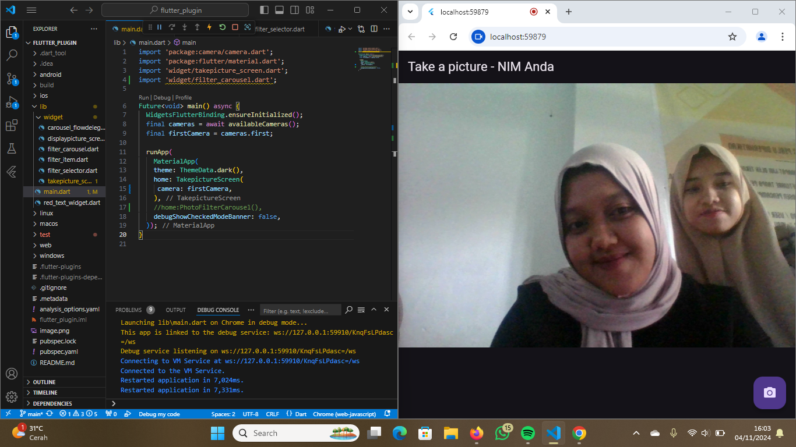

PRAKTIKUM
memakai filter

memakai camera

TUGAS PRAKTIKUM
1. 

2. Jelaskan maksud void async pada praktikum 1?
void async
Ketika sebuah metode dideklarasikan dengan void async, ini berarti metode tersebut adalah metode asinkron yang tidak mengembalikan nilai. Biasanya, metode asinkron memiliki tipe pengembalian Task atau Task<T> untuk menunjukkan bahwa mereka menjalankan operasi asinkron yang dapat ditunggu (await). Namun, jika sebuah metode asinkron dideklarasikan dengan void, metode ini biasanya digunakan dalam konteks di mana metode tidak perlu menunggu pengembalian atau hasil, seperti event handler.

3. Jelaskan fungsi dari anotasi @immutable dan @override ?
~@immutable
Fungsi: Anotasi @immutable biasanya digunakan dalam framework seperti Flutter (dengan bahasa Dart) untuk menandai bahwa sebuah kelas bersifat immutable. Kelas yang bersifat immutable berarti setelah objeknya dibuat, nilai properti di dalamnya tidak dapat diubah.
Tujuan: Anotasi ini membantu pengembang memastikan bahwa objek yang seharusnya tidak berubah tetap aman dari modifikasi yang tidak disengaja, sehingga meningkatkan stabilitas dan keamanan data.
Manfaat: Menggunakan @immutable mendukung prinsip pemrograman fungsional di mana data sebaiknya tidak diubah setelah dibuat, sehingga membantu mencegah bug yang diakibatkan oleh perubahan data secara tidak sengaja.

~@override
Fungsi: Anotasi @override digunakan untuk menunjukkan bahwa sebuah metode di dalam kelas adalah implementasi ulang (override) dari metode yang ada di kelas induk atau antarmuka (interface). Ini digunakan dalam bahasa pemrograman seperti Dart, Java, dan C#.
Tujuan: Anotasi ini membantu memastikan bahwa metode yang di-override benar-benar ada di kelas induk. Jika tidak ada metode yang cocok di kelas induk, kompiler akan memberikan peringatan atau error.
Manfaat: Menggunakan @override membuat kode lebih mudah dibaca dan dipahami karena menunjukkan secara eksplisit bahwa metode tersebut di-override. Selain itu, anotasi ini membantu menghindari kesalahan ketik atau masalah lainnya yang bisa muncul jika metode induk tidak ditemukan.
